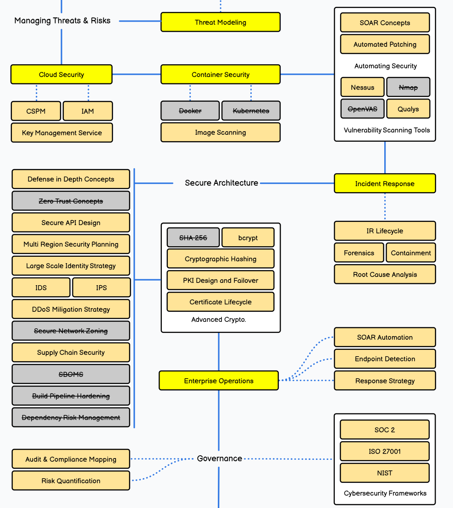
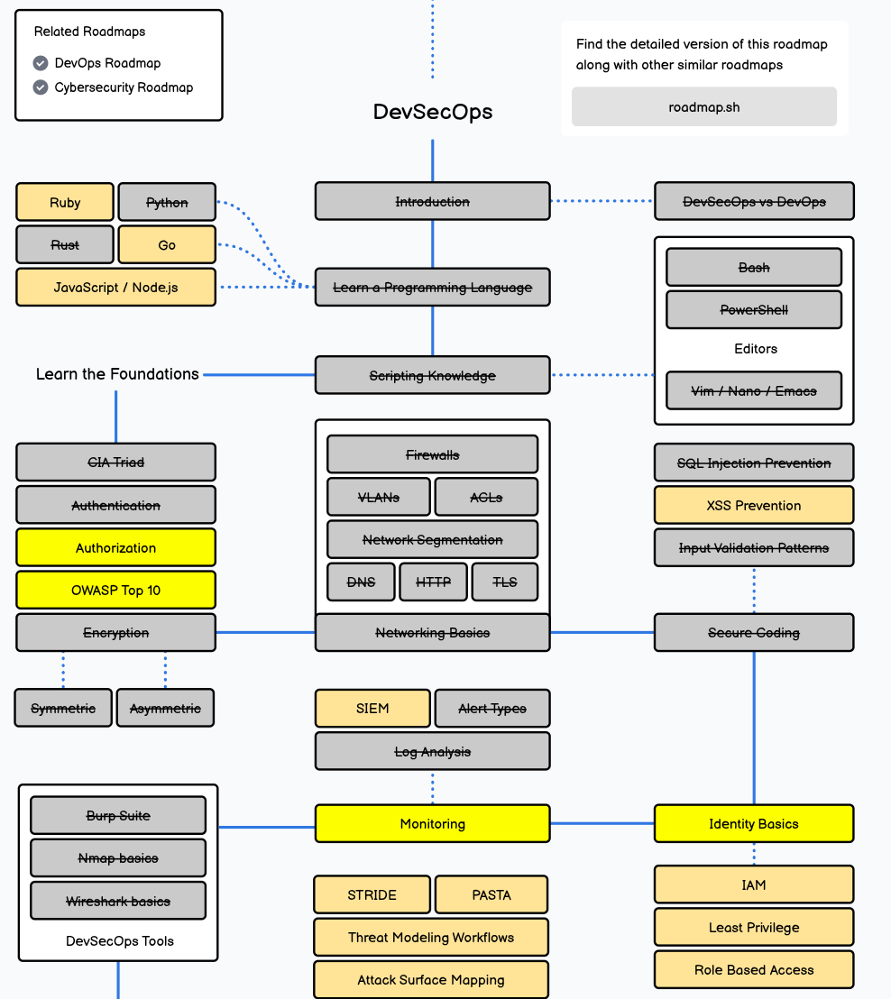

## Objectifs

Évaluer mes compétences existantes en sécurité, en fonction de la formation déjà suivie, des projets effectués et de mes expériences. Le support de référence est la feuille de route DevSecOps de [roadmap.sh](https://roadmap.sh/devsecops).

L'estimation est volontairement rapide : pour chaque thème, une note de 1 (aucune notion, jamais pratiqué) à 5 (à l'aise, pratique régulièrement).

## Identification des métiers pertinents

- Ingénieur DevSecOps : intègre la sécurité à chaque étape du cycle de vie logiciel.
- Security champion / référent sécurité au sein d'une équipe de développement.
- Ingénieur sécurité cloud et conteneurs (CSPM, IAM, analyse d'images).
- Analyste SOC et gestion de la réponse à incident.
- Chargé GRC / gestion des risques.

## Déroulement

### Exercice 1 : compétences de base en sécurité

Les 7 ECTS de sécurité suivis (réseaux et OS, sécurité pratique, cryptographie, protocoles et réseaux) donnent le socle. Je me positionne sur l'échelle 1 à 5 pour chacun des thèmes suivants.

| Thème | Note (1 à 5) |
|---|---|
| Compréhension générale des enjeux de la sécurité | 2 à 3 |
| Compréhension des thèmes déjà vus, niveau théorique | 3 |
| Mise en pratique de ces thèmes, niveau appliqué | 2 |
| Conscience de la sécurité quand je conçois, développe ou maintiens un projet | 3 |
| Réflexes de développement sécurisé concret | 2 |
| Gestion des risques | 1 à 2 |
| Outils cryptographiques | 1 |
| Confinement OS et réseaux | 4 |
| Conscience des risques liés aux facteurs humains | 4 |
| Suivi de sources d'information sécurité de logiciels spécifiques, de plateformes spécifiques ou générales | 1 |
| Envie d'appliquer dans mon projet de semestre ce que je vais apprendre | 5 |

Je me sens clairement à l'aise sur la mise en place d'infrastructure réseau physique dans une entreprise (switch, routeur, firewall, vlan) en revanche je me sens fébrile sur ce qui pourrait toucher au reverse engeenering, j'ai aussi des notions sur le code sécurisé mais qui auraient le mérite d'être approfondis et travaillé.

### Activité 1 : compétences DevSecOps

Je parcours la feuille de route DevSecOps de roadmap.sh et j'inventorie les domaines que j'ai déjà vus ou pratiqués.

{#fig-roadmap-1 fig-alt="Carte mentale de la feuille de route DevSecOps : scripting, secure coding, foundations CIA, monitoring, outils DevSecOps."}

{#fig-roadmap-2 fig-alt="Carte mentale de la feuille de route DevSecOps : cloud security, threat modeling, secure architecture, incident response, governance."}

## Résultats

Deux points forts et une lacune nette se dégagent de l'auto-évaluation.

- Forts : le confinement OS et réseaux (4), ainsi que la conscience des risques liés aux facteurs humains (4).
- Intermédiaires : la compréhension théorique (3) et la conscience de la sécurité pendant un projet (3).
- Faibles : la gestion des risques (1 à 2), la mise en pratique (2), les réflexes de développement sécurisé (2), les outils cryptographiques (1) et le suivi de sources d'information (1).

Sur la feuille de route, la lecture des cases donne le même profil : les domaines déjà vus sont les fondations (triade CIA, authentification, chiffrement symétrique et asymétrique), le confinement réseau (firewalls, VLAN, ACL, DNS/HTTP/TLS) et la surveillance (SIEM, types d'alerte, analyse de logs). Le reste est à considérer comme non pratiqué pour l'instant.

## Interprétation des résultats

Les notes élevées sur le confinement et sur le facteur humain disent la même chose : je raisonne bien sur ce qui est tangible et observable, un segment réseau ou un comportement humain, et moins sur ce qui est abstrait, un niveau de risque à arbitrer ou une primitive cryptographique. C'est cohérent avec le cours 3275.1, qui part justement de la gestion des risques et des mesures de sécurité des données.

## Références

- slides-intro.pdf, p. 7 et 8 (compétences de base de la sécurité, exercice 1).
- slides-intro.pdf, p. 14 et 15 (métiers, normes et certifications, DevSecOps, SAST/DAST/SCA, SIEM et EDR).
- <https://roadmap.sh/devsecops>

## Utilisation IA

Réorganisation des réponses du cahier Word en tableaux et en listes, reformulation des énoncés à partir des slides et reformulation des textes écris initalement par moi-même.
